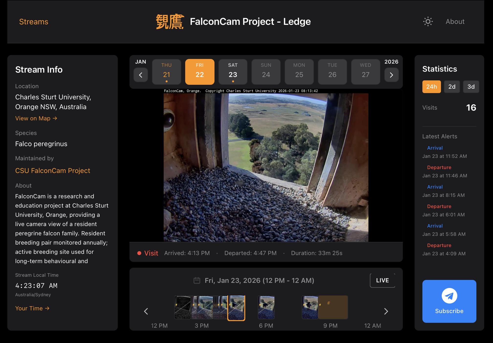

# Kanyo Viewer (観鷹)

**Public-facing web interface for the Kanyo falcon monitoring system.**

[](https://kanyo.sageframe.net)



## What This Is

This is the **viewer component** of the Kanyo project — a React + FastAPI application that displays:

- Live YouTube stream embeds
- Recorded arrival and departure video clips
- HKSV-style event timelines
- Visit statistics and event archives

The viewer reads clip data generated by the [Kanyo detection pipeline](https://github.com/sageframe-no-kaji/kanyo-contemplating-falcons-dev), which automatically monitors falcon camera streams and records events.

## How It Works

```
┌─────────────────────────────────────────────────────────────────────────┐
│                         KANYO SYSTEM OVERVIEW                           │
├─────────────────────────────────────────────────────────────────────────┤
│                                                                         │
│   YouTube Live Stream                                                   │
│          │                                                              │
│          ▼                                                              │
│   ┌──────────────────┐                                                  │
│   │ Kanyo Detection  │  ← separate repo: kanyo-contemplating-falcons    │
│   │ (YOLOv8 + State  │                                                  │
│   │  Machine)        │                                                  │
│   └────────┬─────────┘                                                  │
│            │                                                            │
│            ▼                                                            │
│   clips/YYYY-MM-DD/                                                     │
│   ├── events_YYYY-MM-DD.json   ← event metadata                         │
│   ├── falcon_HHMMSS_arrival.mp4                                         │
│   ├── falcon_HHMMSS_arrival.jpg                                         │
│   ├── falcon_HHMMSS_departure.mp4                                       │
│   └── falcon_HHMMSS_departure.jpg                                       │
│            │                                                            │
│            ▼                                                            │
│   ┌──────────────────┐                                                  │
│   │  Kanyo Viewer    │  ← THIS REPO                                     │
│   │  (React + Fast   │                                                  │
│   │   API)           │                                                  │
│   └────────┬─────────┘                                                  │
│            │                                                            │
│            ▼                                                            │
│   Public Web Interface                                                  │
│   https://kanyo.sageframe.net                                           │
│                                                                         │
└─────────────────────────────────────────────────────────────────────────┘
```

## Features

- **Live Stream Viewing** — Watch YouTube live feeds with one-click toggle
- **Event Timeline** — HKSV-style horizontal timeline with thumbnails positioned by actual event time
- **Dual Timezone Display** — Shows both stream local time and visitor timezone
- **Event Archives** — Browse arrivals and departures by date
- **Statistics** — Visit counts over configurable time ranges (24h, 2d, 3d)
- **Mobile Responsive** — Touch-optimized timeline scrolling
- **Share & Download** — Direct download links and shareable URLs for specific events
- **Dark Theme** — Clean, HKSV-inspired dark interface

## Architecture

```
kanyo-viewer/
├── backend/                 # FastAPI (Python 3.11)
│   ├── app/
│   │   ├── main.py          # FastAPI app entry
│   │   ├── config.py        # Settings and stream loader
│   │   └── routers/         # API endpoints
│   ├── streams.yaml         # Stream registry
│   └── requirements.txt
├── frontend/                # React 18 + Vite + Tailwind CSS 4
│   ├── src/
│   │   ├── pages/           # Landing, StreamView, About
│   │   ├── components/      # Timeline, VideoPlayer, StatsPanel
│   │   └── utils/           # API client, timezone handling
│   └── package.json
├── Dockerfile               # Multi-stage build (Node → Python)
└── docker-compose.yml       # Production deployment
```

## Quick Start

### Production Deployment

```bash
# Clone repo
git clone https://github.com/sageframe-no-kaji/kanyo-viewer.git
cd kanyo-viewer

# Configure streams (edit with your stream paths)
nano backend/streams.yaml

# Start with Docker
docker compose up -d

# Access at http://localhost:3000
```

### Local Development

**Backend:**
```bash
cd backend
pip install -r requirements.txt
uvicorn app.main:app --reload --port 5000
```

**Frontend:**
```bash
cd frontend
npm install
npm run dev
# → http://localhost:5173 (proxies API to backend)
```

## Configuration

### Stream Registry (`backend/streams.yaml`)

```yaml
streams:
  kanyo-harvard:
    config_path: "/configs/harvard/config.yaml"
    data_path: "/data/harvard"

  kanyo-nsw:
    config_path: "/configs/nsw/config.yaml"
    data_path: "/data/nsw"
```

Each stream's `config.yaml` (from the detection pipeline) provides display metadata:

```yaml
stream_name: "Harvard FAS Falcon Cam"
timezone: "America/New_York"
display:
  short_name: "Harvard FAS"
  location: "Memorial Hall, Harvard University, Cambridge MA"
  species: "Falco peregrinus"
  maintainer: "Harvard FAS"
  maintainer_url: "https://falconcam.fas.harvard.edu"
```

### Landing Page Thumbnails

Place static images in `frontend/public/thumbnails/`:

```
frontend/public/thumbnails/
├── kanyo-harvard.jpg    # Filename = stream ID
└── kanyo-nsw.jpg
```

Recommended: 1280×720 JPG, under 500KB.

### Data Structure Expected

The viewer expects clips organized by date:

```
/data/{stream_id}/clips/
├── 2026-01-23/
│   ├── events_2026-01-23.json
│   ├── falcon_072315_arrival.mp4
│   ├── falcon_072315_arrival.jpg
│   ├── falcon_074530_departure.mp4
│   └── falcon_074530_departure.jpg
└── 2026-01-24/
    └── ...
```

This structure is created automatically by the [Kanyo detection pipeline](https://github.com/sageframe-no-kaji/kanyo-contemplating-falcons-dev).

## API Endpoints

| Endpoint | Description |
|----------|-------------|
| `GET /api/streams` | List all streams with 24h stats |
| `GET /api/streams/{id}` | Stream detail with display metadata |
| `GET /api/streams/{id}/events?date=YYYY-MM-DD` | Events for specific date |
| `GET /api/streams/{id}/stats?range=24h\|2d\|3d` | Stats for time range |
| `GET /api/clips/{stream}/{date}/{filename}` | Serve media files |
| `GET /api/visitor/timezone` | Detect visitor timezone from IP |

## Deployment

### Docker Compose (Production)

```yaml
services:
  viewer:
    build: .
    ports:
      - "3000:3000"
    volumes:
      # Mount clip directories from detection containers
      - /opt/services/kanyo-harvard:/data/harvard:ro
      - /opt/services/kanyo-nsw:/data/nsw:ro
      # Mount config files for display metadata
      - /opt/services/kanyo-harvard/config.yaml:/configs/harvard/config.yaml:ro
      - /opt/services/kanyo-nsw/config.yaml:/configs/nsw/config.yaml:ro
    restart: unless-stopped
```

### Cloudflare Tunnel (Public Access)

The viewer at `kanyo.sageframe.net` is exposed via Cloudflare Tunnel, keeping the origin server private.

## Related Projects

| Project | Description |
|---------|-------------|
| [kanyo-contemplating-falcons](https://github.com/sageframe-no-kaji/kanyo-contemplating-falcons-dev) | Detection pipeline — YOLOv8, state machine, clip recording, Telegram notifications |
| kanyo-admin | Admin interface for managing streams (part of detection repo) |

## Technology Stack

- **Backend**: FastAPI, Python 3.11, PyYAML, pytz
- **Frontend**: React 18, Vite, React Router, Tailwind CSS 4
- **Deployment**: Docker, docker-compose, Cloudflare Tunnel

## Origin Story

The Kanyo project was born from a conversation with Claudia Goldin (Nobel laureate in Economics) on a flight to New York. She expressed interest in having the Harvard falcon cam automatically mark timestamps when the peregrines are actually in frame — and now it does.

## License

MIT
