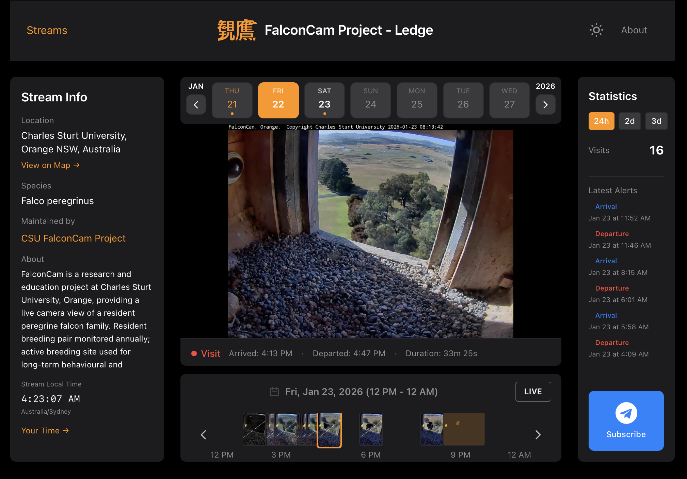

# Kanyo Viewer (観鷹)

**Public-facing web interface for the Kanyo falcon monitoring system.**

[](https://kanyo.sageframe.net)



**Development Process:** This project was built using the [Ho System](https://atmarcus.net/work/ho-system), a structured methodology for human-AI collaborative development. The human makes every design decision. The AI implements under direction. There is verification at every step.

## What This Is

This is the **viewer component** of the Kanyo project — a React + FastAPI application that displays:

- Live YouTube stream embeds
- Recorded arrival and departure video clips
- HKSV-style event timelines
- Visit statistics and event archives

The viewer reads clip data generated by the [Kanyo detection pipeline](https://github.com/sageframe-no-kaji/kanyo-contemplating-falcons-dev), which automatically monitors falcon camera streams and records events.

## How It Works

```
┌─────────────────────────────────────────────────────────────────────────┐
│                         KANYO SYSTEM OVERVIEW                           │
├─────────────────────────────────────────────────────────────────────────┤
│                                                                         │
│   YouTube Live Stream                                                   │
│          │                                                              │
│          ▼                                                              │
│   ┌──────────────────┐                                                  │
│   │ Kanyo Detection  │  ← separate repo: kanyo-contemplating-falcons    │
│   │ (YOLOv8 + State  │                                                  │
│   │  Machine)        │                                                  │
│   └────────┬─────────┘                                                  │
│            │                                                            │
│            ▼                                                            │
│   clips/YYYY-MM-DD/                                                     │
│   ├── events_YYYY-MM-DD.json   ← event metadata (authoritative)         │
│   ├── falcon_HHMMSS_MICROSECONDS_arrival.mp4 / .jpg                     │
│   ├── falcon_HHMMSS_MICROSECONDS_visit.mp4                              │
│   └── falcon_HHMMSS_MICROSECONDS_departure.mp4 / .jpg                   │
│            │                                                            │
│            ▼                                                            │
│   ┌──────────────────┐                                                  │
│   │  Kanyo Viewer    │  ← THIS REPO                                     │
│   │  (React + Fast   │                                                  │
│   │   API)           │                                                  │
│   └────────┬─────────┘                                                  │
│            │                                                            │
│            ▼                                                            │
│   Public Web Interface                                                  │
│   https://kanyo.sageframe.net                                           │
│                                                                         │
└─────────────────────────────────────────────────────────────────────────┘
```

## Features

- **Live Stream Viewing** — Watch YouTube live feeds with one-click toggle
- **Event Timeline** — HKSV-style horizontal timeline with thumbnails positioned by actual event time
- **Dual Timezone Display** — Shows both stream local time and visitor timezone
- **Event Archives** — Browse arrivals and departures by date
- **Statistics** — Visit counts over configurable time ranges (24h, 2d, 3d)
- **Mobile Responsive** — Touch-optimized timeline scrolling
- **Share & Download** — Direct download links and shareable URLs for specific events
- **Dark Theme** — Clean, HKSV-inspired dark interface

## Architecture

```
kanyo-viewer/
├── backend/                 # FastAPI (Python 3.11)
│   ├── app/
│   │   ├── main.py          # FastAPI app entry
│   │   ├── config.py        # Settings + stream auto-discovery from KANYO_DATA_DIR
│   │   └── routers/         # API endpoints
│   └── requirements.txt
├── frontend/                # React 18 + Vite + Tailwind CSS 4
│   ├── src/
│   │   ├── pages/           # Landing, StreamView, About
│   │   ├── components/      # Timeline, VideoPlayer, StatsPanel
│   │   └── utils/           # API client, timezone handling
│   └── package.json
├── Dockerfile               # Multi-stage build (Node → Python)
└── docker-compose.yml       # Production deployment
```

## Quick Start

### Production Deployment

```bash
# Clone repo
git clone https://github.com/sageframe-no-kaji/kanyo-viewer.git
cd kanyo-viewer

# Point the viewer at your detector data root (default /data via docker-compose;
# each subdirectory containing a config.yaml is discovered as a stream)
export KANYO_DATA_DIR=/opt/services

# Start with Docker
docker compose up -d

# Access at http://localhost:3000
```

### Local Development

**Backend:**
```bash
cd backend
pip install -r requirements.txt
uvicorn app.main:app --reload --port 5000
```

**Frontend:**
```bash
cd frontend
npm install
npm run dev
# → http://localhost:5173 (proxies API to backend)
```

## Configuration

### Stream Discovery

Streams are discovered automatically: the backend scans `KANYO_DATA_DIR`
(default `/data`) and treats every immediate subdirectory containing a
`config.yaml` as a stream. The directory name becomes the stream ID:

```
/data/
├── kanyo-harvard/
│   ├── config.yaml      # detection pipeline config (display metadata, timezone)
│   └── clips/           # detector output (see Data Contract below)
└── kanyo-nsw/
    ├── config.yaml
    └── clips/
```

Each stream's `config.yaml` (from the detection pipeline) provides display metadata:

```yaml
stream_name: "Harvard FAS Falcon Cam"
timezone: "America/New_York"
display:
  short_name: "Harvard FAS"
  location: "Memorial Hall, Harvard University, Cambridge MA"
  species: "Falco peregrinus"
  maintainer: "Harvard FAS"
  maintainer_url: "https://falconcam.fas.harvard.edu"
```

### Landing Page Thumbnails

Place static images in `frontend/public/thumbnails/`:

```
frontend/public/thumbnails/
├── kanyo-harvard.jpg    # Filename = stream ID
└── kanyo-nsw.jpg
```

Recommended: 1280×720 JPG, under 500KB.

### Data Contract (detector output)

The viewer reads what the [Kanyo detection pipeline](https://github.com/sageframe-no-kaji/kanyo-contemplating-falcons-dev)
writes. Per stream, clips are organized by date:

```
/data/{stream_id}/clips/
├── 2026-01-23/
│   ├── events_2026-01-23.json                    # visit rows (authoritative)
│   ├── falcon_072315_123456_arrival.mp4 / .jpg   # arrival clip + snapshot
│   ├── falcon_072315_123456_visit.mp4            # full-visit recording
│   ├── falcon_074530_654321_departure.mp4 / .jpg # departure clip + snapshot
│   ├── falcon_101500_111111_visit.mp4.tmp        # in-progress recording (ignored)
│   └── falcon_101500_111111_visit.mp4.ffmpeg.log # ffmpeg sidecar (ignored)
└── 2026-01-24/
    └── ...
```

**Filenames** are `falcon_HHMMSS[_MICROSECONDS]_(arrival|departure|visit).(mp4|jpg)`.
Current detector versions always include the 6-digit microsecond segment (so two
events in the same second don't collide); archived dates from older versions may
lack it, and the viewer accepts both. The `HHMMSS` is **stream-local** time.
`.mp4.tmp` in-progress files and `.ffmpeg.log` sidecars are never served or counted.

**`events_YYYY-MM-DD.json`** is the authority for visit boundaries, durations, and
counts. Each row is a serialized `FalconVisit`:

| Field | Meaning |
|-------|---------|
| `id` | `YYYYMMDD_HHMMSS` of the visit start |
| `start_time` / `end_time` | Timezone-aware ISO timestamps (stream timezone) |
| `duration_seconds` / `duration_str` | Dwell time of the visit |
| `peak_confidence` | Highest detection confidence during the visit |
| `thumbnail_path` | Arrival snapshot for the visit (may be null) |
| `arrival_clip_path` / `departure_clip_path` | Recorded clips (may be null) |
| `insignificant` | `true` for visits below the significance threshold — recorded log-only, excluded from headline counts |
| `merged_segments` | `>= 2` when the row spans merged visit segments |

Two consequences the viewer is built around:

- **A visit is not one file.** Merged visits (`merged_segments >= 2`) can span
  multiple `_visit.mp4` files; the viewer associates files to a row by time
  containment in `[start_time, end_time]` and plays the earliest.
- **Clip length is not dwell time.** Visits with roosting stops have recording
  files much shorter than the visit itself; durations always come from the JSON.
  Only dates with no JSON at all (e.g., a visit still in progress) fall back to
  scanning files and probing durations with ffprobe.

**Timezones:** the `timezone` in each stream's `config.yaml` is an IANA name
(e.g., `America/New_York`). All event times are rendered in the stream's
timezone, so what the viewer shows matches what the camera saw.

## API Endpoints

| Endpoint | Description |
|----------|-------------|
| `GET /api/streams` | List all streams with 24h stats |
| `GET /api/streams/{id}` | Stream detail with display metadata |
| `GET /api/streams/{id}/events?date=YYYY-MM-DD` | Events for specific date |
| `GET /api/streams/{id}/dates-with-events?start_date=&end_date=` | Dates in range that have visit clips |
| `GET /api/streams/{id}/stats?range=24h\|2d\|3d` | Stats for time range |
| `GET /api/streams/{id}/snapshot` | Most recent arrival snapshot |
| `GET /api/streams/{id}/hls/playlist.m3u8` | Proxied HLS manifest for the live stream |
| `GET /api/clips/{stream}/{date}/{filename}` | Serve media files |
| `GET /api/visitor/timezone` | Detect visitor timezone from IP |

## Deployment

### Docker Compose (Production)

```yaml
services:
  viewer:
    build: .
    ports:
      - "3000:3000"
    volumes:
      # Mount the services root read-only. The viewer auto-discovers streams
      # by scanning for subdirectories containing config.yaml.
      - /opt/services:/data:ro
    restart: unless-stopped
```

### Cloudflare Tunnel (Public Access)

The viewer at `kanyo.sageframe.net` is exposed via Cloudflare Tunnel, keeping the origin server private.

## Related Projects

| Project | Description |
|---------|-------------|
| [kanyo-contemplating-falcons](https://github.com/sageframe-no-kaji/kanyo-contemplating-falcons-dev) | Detection pipeline — YOLOv8, state machine, clip recording, Telegram notifications |
| kanyo-admin | Admin interface for managing streams (part of detection repo) |

## Technology Stack

- **Backend**: FastAPI, Python 3.11, PyYAML, pytz
- **Frontend**: React 18, Vite, React Router, Tailwind CSS 4
- **Deployment**: Docker, docker-compose, Cloudflare Tunnel

## Origin Story

The Kanyo project was born from a conversation with Claudia Goldin (Nobel laureate in Economics) on a flight to New York. She expressed interest in having the Harvard falcon cam automatically mark timestamps when the peregrines are actually in frame — and now it does.

## License

MIT
